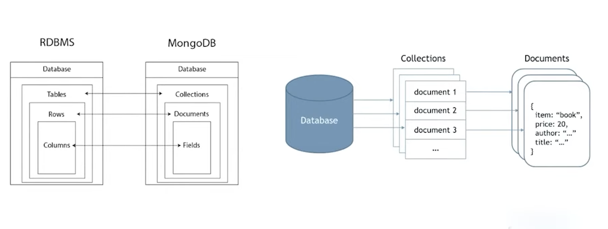
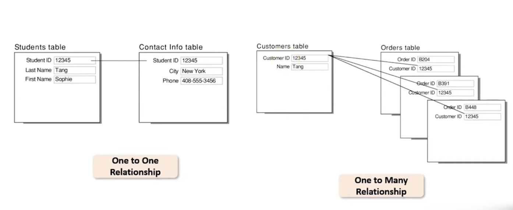

# MongoDB

### BRIEF INTRODUCTION TO NOSQL


NoSQL is a non-relational database that uses key-value pairs to store and retrieve data. Unlike a relational database, which stores data in rows and columns.

### Non-relational database

NON RELATIONAL DATABASE is a collection of unstructured and semi structured items which do not store data n tabular form.

## what is mongoDB

MongoDB is a NoSQL (Not only SQL) database that stores large volumes of data in the form of documents. MongoDB removes the concept of "rows" of conventional and relational data models by introducing "documents." This offers the developers the flexibility to work with evolving data models.

- (DOCUMENT BASED) Represents Hierarchical relationship in a single record instead of multiple tables.
- (Relational data model) Highly-structured table organization with rigidly-defined data formats and record structures.
- (Document data model) Collection of complex documents with arbitrary. nested data formats and varying "record" format.

## why MONGODB is Used?

- Open-source database
- Easy to use: Robust, highly scalable and powerful way of storing data in comparison to traditional database models.
- Highly Flexible: Allows you to store and work on different data types in one document.
- Advanced Security
- Powerful Query Language
- Reliable Indexing
- Flexible Schema: design that allows you to meet the ever-changing conditions characteristic of Big Data applications.
- High Performance: MongoDB offers incredible features like on-demand scaling, real-time resources, etc. to guarantee high performance of the applications

## How does MongoDB Work?

MongoDB stores data objects in collections and documents instead of the tables and rows used in traditional relational databases. Collections comprise sets of documents, which are equivalent to tables in a relational database. Documents consist of key-value pairs, which are the basic unit of data in MongoDB.

## Applications of MongoDB

- Internet Of Things
- Mobile applications
- Real time analysis
- Personalization
- Catalog management
- Content management

India's Unique Identification project boasts the largest biometric database in the world. The Aadhar Project uses MongoDB to store the massive demographic and biometric data of over 1.5 billion Indians. Aadhar also uses MongoDB to store images, QR Code details etc

## Companies using MongoDB
- Google
- facebook
- BOSCH
- TOYOTA
- CISCO
- Adobe
- ebay
etc....

## SQL VS NOSQL

STRUCTURED QUERY LANGUAGE IS USED TO COMMUNICATE WITH DATABASE. ALLOWS THE USER TO ACCESS AND MANIPULATE DATA STORED IN THE DATABASE. it is used for 
- INSERT
- UPDATE
- MODIFY
- DELETE

## RELATIONAL DATABASE SYSTEMS

RELATIONAL DATABASE IS THE USED TO ORGANIZE STRUCTURED DATA INTO TABLES IN THE FORM OF ROWS AND COLUMNS

## POPULAR SQL DATABASES

- mysql
- oracel database
- SQL Server (Microsoft SQL Server)
- SQLite

## WHAT IS NOSQL

NosQL is a non-relational database that uses key-value pairs to store and retrieve data. Unlike a relational database, which stores data in rows and columns

## NON RELATIONAL DATABASE

NON RELATIONAL DATABASE IS A COLLECTION OF UNSTRUTURED AND SEMI STRUCTURED ITEMS WHICH DO NOT STORE DATA IN TABULAR FORM

## WHY WE USE NOSQL?

- HIERARCHICAL STORAGE STRUCTURE INSTEAD OFA TABLE-LIKE STRUCTURE.
- CONSTANT ADDITION OF NEW FEATURES AND FUNCTIONS
- RELATIONSHIP BETWEEN STORED DATA IS NOT IMPORTANT

## POPULAR NOSQL DATABASES

- mongoDB
- apaceh HBASE
- cassandra
- redis
- neo4j

## Types of NOSQL DATABASES

- Document oriented
- Key value pair
- Column based
- Graph Oriented



## HOW NOSQL WORKS?

```json
{
    "_id": "5cf0029caff5056591b0ce7d",
    "firstname": "Jane",
    "lastname": "Wu",
    "address": {
    "street": "1 Circle Rd",
    "city": "Los Angeles",
    "state": "CA",
    "zip": "90404"
    },
    "hobbies": ["surfing", "coding"]
}
```

## Difference between Sql and Nosql

| **Characteristics** | **SQL (MySQL)** | **NoSQL** |
| --- | --- | --- |
| **Data Structure** | Structured, tables with fixed schema | Unstructured, flexible schema |
| **Data Storage** | Tables with rows and columns | Key-value, documents, graphs, or column families |
| **Scalability** | Vertical scaling, limited scalability | Horizontal scaling, high scalability |
| **Performance** | Good for complex queries, slower for large datasets | Good for large datasets, faster for simple queries |
| **Querying** | Uses SQL, supports complex queries | Uses various query languages, supports simple queries |
| **Flexibility** | Rigid schema, less flexible | Flexible schema, highly adaptable |
| **Data Modeling** | Supports complex relationships, ACID properties | Supports flexible data models, eventual consistency |
| **Use Cases** | Suitable for structured data, complex queries | Suitable for unstructured data, big data, real-time web apps |


## ADVANTAGES & DISADVANTAGES OF USING NOSQL

### ADVANTAGES

- HIGH PERFORMANCE AND SCALABILITY
- AVAILABILITY AND FLEXIBILITY
- OPEN SOURCE AND SCHEMA LESS

### DISADVANCES

- LACK OF STANDARDIZATION
- CONSISTENCY ISSUES
- LIMITED QUERY CAPABILITIES


## What is Data Modeling in MongoDB?

- Data modelling is the process of determining how data is stored and what connections exist between various entities in our data.

## Why we use Data Modeling?

Data model helps create a simplified and optimized logical database that eliminates redundancy, reduces storage requirements, and enables efficient retrieval.

- High Data Quality 
- Understanding data flow and Characteristics
- Development and Maintenance
- Performance

## How Data Modeling works in MongoDB?
MongoDB document contains different types of fields and objects in the collection that we have used in MongoDB schema.

- Create and design Schema
- Combine Documents
- Optimization and Perfomance

## Data Models used in MongoDB
Data models for a database system can be conceptualized into three categories based on the level of specificity or detail.

- CONCEPTUAL DATA MODEL
- LOGICAL DATA MODEL
- PHYSICAL DATA MODEL

## Types of Relationships in Data models
- One to One:
when one field can only have one value it will consider as a one-to-one relationship between data.

- One to Many:
When one filed has multiple relationship between the data

- Many to Many:
When two or more entities within a document can have multiple relationships.




# MONGODB Operators
 
## What are MongoDB Operators?
MongoDB query operators are simply keywords or special symbols that tell the interpreter how to process logical or mathematical operations.

SYNTAX

```js
db.name_of_collection.find ({
"Field _name": { Squery_operator_name:
"value" }}) .pretty()
```

### Types of Operators in MongoDB

- Query and Projection Operator:
    projection refers to picking only the data that is required rather than the entire document's data.
- Update operator:
    updates the values of the fields of documents matching the specified condition
- Aggregation Pipeline:
    As a result of processing the data records and documents, aggregation operations provide computed results.

## Query and Projection Operators


### Comparison Operator:

Comparison operators are used to compare two expressions and retrieve data (documents) from the MongoDB database (collections)

| **Operator** | **Description** |
| --- | --- |
| `$eq` | Matches values that are equal to the value specified in the query |
| `$ne` | Matches all values that are not equal to the value specified in the query |
| `$gt` | Matches values that are greater than the value specified in the query |
| `$gte` | Matches values that are greater than or equal to the value specified in the query |
| `$lt` | Matches values that are less than the value specified in the query |
| `$lte` | Matches values that are less than or equal to the value specified in the query |

- EQ AND NE Operator

`$eq` Operator Example

**Query:** Find all documents where the `age` field is equal to 25.
```bash
db.collection.find({ age: { $eq: 25 } })
```
**Result:** Returns all documents where the `age` field is exactly 25.

**Example Document:**
```json
{
  _id: ObjectId,
  name: "John",
  age: 25
}
```
`$ne` Operator Example

**Query:** Find all documents where the `country` field is not equal to "USA".
```bash
db.collection.find({ country: { $ne: "USA" } })
```
**Result:** Returns all documents where the `country` field is not "USA".

**Example Document:**
```json
{
  _id: ObjectId,
  name: "Jane",
  country: "Canada"
}
```
Note: You can also use the `$eq` and `$ne` operators with other data types, such as strings, arrays, and objects.

- GT and GTE Operators

The GT (Greater Than) and GTE (Greater Than or Equal To) operators are used to compare values in a query.

**GT Operator**

* Matches values that are greater than the value specified in the query.
* Example: `db.collection.find({ age: { $gt: 25 } })` returns all documents where the `age` field is greater than 25.

**GTE Operator**

* Matches values that are greater than or equal to the value specified in the query.
* Example: `db.collection.find({ age: { $gte: 25 } })` returns all documents where the `age` field is greater than or equal to 25.

Here is a table summarizing the GT and GTE operators:

| **Operator** | **Description** | **Example** |
| --- | --- | --- |
| `$gt` | Matches values greater than the specified value | `db.collection.find({ age: { $gt: 25 } })` |
| `$gte` | Matches values greater than or equal to the specified value | `db.collection.find({ age: { $gte: 25 } })` |

- LT and LTE Operators

The LT (Less Than) and LTE (Less Than or Equal To) operators are used to compare values in a query.

**LT Operator**

* Matches values that are less than the value specified in the query.
* Example: `db.testtable.find({ age: { $lt: 19 } }).pretty()` returns all documents where the `age` field is less than 19.

**LTE Operator**

* Matches values that are less than or equal to the value specified in the query.
* Example: `db.testtable.find({ age: { $lte: 19 } }).pretty()` returns all documents where the `age` field is less than or equal to 19.

Here is a table summarizing the LT and LTE operators:

| **Operator** | **Description** | **Example** |
| --- | --- | --- |
| `$lt` | Matches values less than the specified value | `db.testtable.find({ age: { $lt: 19 } }).pretty()` |
| `$lte` | Matches values less than or equal to the specified value | `db.testtable.find({ age: { $lte: 19 } }).pretty()` |

Note: The `pretty()` method is used to display the results in a formatted way.

Here is an example document that matches the LTE operator:
```json
{
        "_id" : ObjectId,
        "friends" : {
                "valued_friends_id" : [
                        "pal",
                        "viki",
                        "john"
                ],
                "ban_friends_id" : [
                        "jalan",
                        "mono j",
                        "evan"
                ]
        }
}
```
This document would be returned by the query `db.testtable.find({ age: { $lte: 19 } }).pretty()` if the `age` field is less than or equal to 19.

### Logical Operator
Logical operators return data based on expressions that evaluate to true or false.

| **Operator** | **Description** |
| --- | --- |
| `$and` | Returns all documents that match the conditions of both expressions. |
| `$or` | Returns all documents that match the conditions of either expression. |
| `$nor` | Returns all documents that do not match the conditions of either expression. |
| `$not` | Inverts the effect of a query expression and returns documents that do not match the query expression. |

### `$and` Operator

**Query:** Find all documents where `age` is greater than 25 and `country` is "USA".
```bash
db.collection.find({ $and: [{ age: { $gt: 25 } }, { country: "USA" }] })
```
**Result:** Returns all documents where both conditions are true.

### `$or` Operator

**Query:** Find all documents where `age` is greater than 25 or `country` is "Canada".
```bash
db.collection.find({ $or: [{ age: { $gt: 25 } }, { country: "Canada" }] })
```
**Result:** Returns all documents where at least one of the conditions is true.

### `$nor` Operator

**Query:** Find all documents where `age` is not greater than 25 and `country` is not "USA".
```bash
db.collection.find({ $nor: [{ age: { $gt: 25 } }, { country: "USA" }] })
```
**Result:** Returns all documents where neither of the conditions is true.

### `$not` Operator

**Query:** Find all documents where `age` is not equal to 25.
```bash
db.collection.find({ age: { $not: { $eq: 25 } } })
```
**Result:** Returns all documents where the `age` field is not equal to 25.

Note: These examples assume a collection with documents containing `age` and `country` fields. The actual field names and values may vary depending on your specific use case.

### Element Operator

the element query operators are used to locate document based on the fields of the document.


| **Operator** | **Description** |
| --- | --- |
| `$exists` | Returns documents that have a specific field. |
| `$type` | Returns documents if field is of a specified type. |

`$exists` Operator

**Query:** Find all documents that have a `phone` field.

```bash
db.employees.find({ "empAge": { Sexists: true, $gte: 35}})

```

`$type` Operator

**Query:** Find all documents where the `score` field is an array.

```bash
db.employees.find({ "empAge": { $type: "double"}})
```
### Array Operators

| **Operator** | **Description** |
| --- | --- |
| `$all` | Matches arrays that contain all elements specified in the query. |
| `$elemMatch` | Selects documents if element in the array field matches all the specified $elemMatch conditions. |
| `$size` | Matches arrays with the specified number of elements. |

Note: These examples assume a collection named `order` with documents containing an `OrderItems` array field. The actual field names and values may vary depending on your specific use case.

### `$all` Operator

**Query:** Find all orders that contain both "notebook" and "paper" in the `OrderItems` array.
```bash
db.order.find({ "OrderItems.ItemName": { $all: ["notebook", "paper"] } })
```
**Result:** Returns the order with `_id` "1477488388843" because it contains both "notebook" and "paper" in the `OrderItems` array.

### `$size` Operator

**Query:** Find all orders that have exactly 4 items in the `OrderItems` array.
```bash
db.order.find({ "OrderItems": { $size: 4 } })
```
**Result:** Returns no orders because none of the orders have exactly 4 items in the `OrderItems` array.

### `$elemMatch` Operator

**Query:** Find all orders that have an item with `ItemName` "postcard" and `Price` "10.00" in the `OrderItems` array.
```bash
db.order.find({ "OrderItems": { $elemMatch: { ItemName: "postcard", Price: "10.00" } } })
```
**Result:** Returns the orders with `_id` "146588300039" and "1477488388843" because they both have an item with `ItemName` "postcard" and `Price` "10.00" in the `OrderItems` array.


### Update Operators

MongoDB offers a variety of field updats operators to update the values of the fields of documents matching the specified condition.

| **Operator** | **Description** |
| --- | --- |
| `$currentDate` | Sets the value of a field to the current date, either as a Date or a Timestamp. |
| `$inc` | Increments the value of a field by the specified amount. |
| `$min` | Updates the field if the specified value is less than the existing field value. |
| `$max` | Updates the field if the specified value is greater than the existing field value. |
| `$mul` | Multiplies the value of a field by the specified amount. |

Here are some examples for each of the operators:

### `$currentDate` Operator

**Query:** Update the `lastUpdated` field to the current date for all documents in the `orders` collection.
```bash
db.orders.updateMany({}, { $currentDate: { lastUpdated: true } })
```
**Result:** Sets the `lastUpdated` field to the current date for all documents in the `orders` collection.

### `$inc` Operator

**Query:** Increment the `quantity` field by 2 for all documents in the `orders` collection.
```bash
db.orders.updateMany({}, { $inc: { quantity: 2 } })
```
**Result:** Increments the `quantity` field by 2 for all documents in the `orders` collection.

### `$min` Operator

**Query:** Update the `price` field to 10 if it is greater than 10 for all documents in the `orders` collection.
```bash
db.orders.updateMany({}, { $min: { price: 10 } })
```
**Result:** Updates the `price` field to 10 if it is greater than 10 for all documents in the `orders` collection.

### `$max` Operator

**Query:** Update the `price` field to 20 if it is less than 20 for all documents in the `orders` collection.
```bash
db.orders.updateMany({}, { $max: { price: 20 } })
```
**Result:** Updates the `price` field to 20 if it is less than 20 for all documents in the `orders` collection.

### `$mul` Operator

**Query:** Multiply the `price` field by 2 for all documents in the `orders` collection.
```bash
db.orders.updateMany({}, { $mul: { price: 2 } })
```

## What are Regular Expressions in MongoDB?

Regular Expressions are used to match patterns in a Document.


- Provides patterns or a sequence of characters for matching text and define search pattern.
- Retrieving an unidentified field in a document easily
- Query databases to find a smaller subset of data within a Collection

## What is $Regex operator?

$Regex operator provides regular expression capabilities for pattern matching strings in the queries

SYNTAX
• db.collection_name.find{ <field>:{ $regex: /pattern/ }}
• { <field>: { $regex: "pattern$", 1}}
• { <field>: { $regex: /pattern/, $options:'s/x/i/m'33}}

## How Regex Works in MongoDB

In MongoDB, regex (regular expression) is used to match patterns in strings. The `$regex` operator is used to specify a regex pattern to match against a string field.

Here is an example of how to use regex in MongoDB:
```bash
db.products.find( { sku: { $regex: /789$/ } } )
```
This query matches all documents where the `sku` field ends with `789`.

You can also use options with the `$regex` operator to modify the behavior of the regex match. For example, the `i` option makes the match case-insensitive:
```bash
db.products.find( { sku: { $regex: /^ABC/i } } )
```
This query matches all documents where the `sku` field starts with `ABC`, regardless of case.

Another option is the `m` option, which allows the regex pattern to match multiple lines:
```bash
db.products.find( { description: { $regex: /^S/, $options: '' } } )
```
This query matches all documents where the `description` field starts with `S`, even if it is a multi-line string.

You can also use the `s` option to allow the dot character (`.`) to match all characters, including newlines:
```bash
db.products.find( { description: { $regex: /m.*line/, $options: 'i' } } )
```
This query matches all documents where the `description` field contains the string `m` followed by any characters (including newlines) and then the string `line`.

Here is a table summarizing the regex options in MongoDB:

| Option | Description |
| --- | --- |
| `i` | Case-insensitive match |
| `m` | Multi-line match |
| `s` | Dot character matches all characters, including newlines |
| `x` | Ignore whitespace characters |
