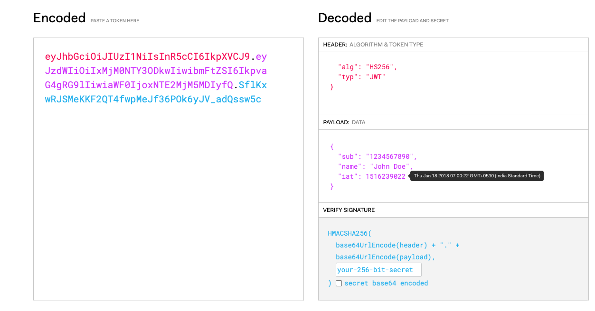

# JWT ( JSON Web Token ) Tokens

## What is JWT Token?

JSON Web Tokens are an open, industry standard `RFC 7519` method for representing claims securely between two parties.

JWT.IO allows you to decode, verify and generate JWT.

## How is a JWT Structured?

- RED String determines which algorithm you are using.
- PURPLE String determines what information is their.
- BLUE String determines a Verify signature.

## Authentication vs Authorization

**Authentication** and **Authorization** are two key concepts in the realm of security, especially in the context of web applications and services. They serve different purposes but are often used together to secure systems.

### Authentication

**Authentication** is the process of verifying the identity of a user or entity. It answers the question, "Who are you?"

#### Example:
Imagine you are trying to log into your email account. The steps might include:

1. **Entering your username/email:** This is your identifier.
2. **Entering your password:** This is your credential.
3. **Two-factor authentication (if enabled):** You might need to enter a code sent to your phone or generated by an app.

In this process, the system checks the information you provided against its records to confirm that you are indeed who you claim to be.

### Authorization

**Authorization** is the process of determining whether a user or entity has the right to access certain resources or perform specific actions. It answers the question, "What are you allowed to do?"

#### Example:
Continuing with the email scenario, once you have successfully authenticated and logged in, authorization comes into play:

1. **Access to your inbox:** You are authorized to read and manage your emails.
2. **Settings access:** You may have permissions to change your account settings.
3. **Admin tasks:** If you are an admin user, you might have additional rights to manage other users' accounts.

In essence, even though you have been authenticated and allowed into the system, what you can do within the system is governed by your authorization level.

### Combined Example

Consider a company intranet system:

1. **Authentication:** 
   - Employees log in using their company credentials (username and password).
   - The system verifies their identity through a centralized authentication service.

2. **Authorization:**
   - Once authenticated, the system checks their roles.
   - Regular employees can access their personal dashboards, submit leave requests, and read company announcements.
   - Managers have additional rights to approve leave requests and view team performance reports.
   - IT administrators have the highest level of access, allowing them to manage user accounts, modify system settings, and monitor system health.

## How do you securely store a JWT on the Client side?

